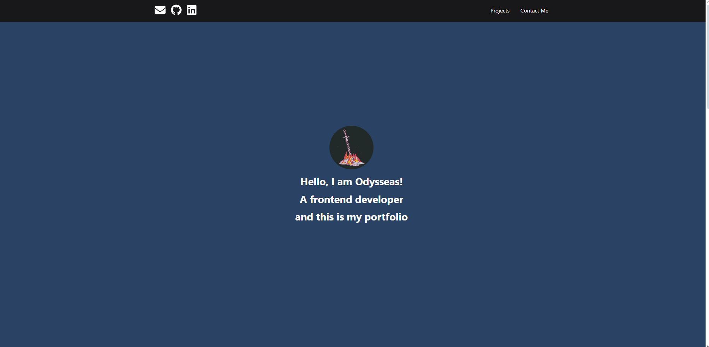
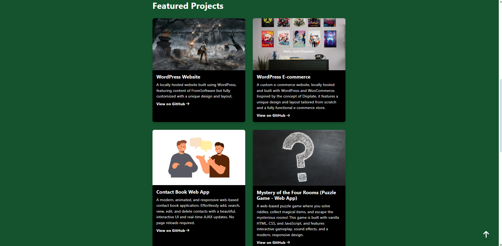
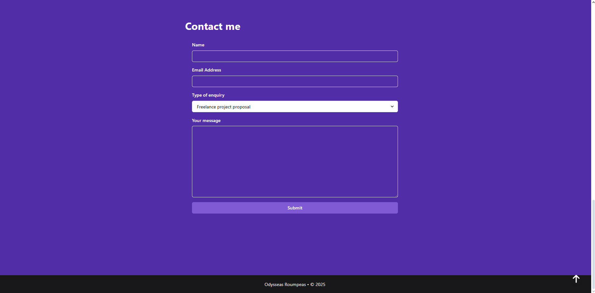

# React Portfolio

A modern, responsive portfolio website built with React and Chakra UI.  
Showcases my projects, skills, and contact information.  
Deployed for anyone to view and connect with me!

---

## 🚀 Features

- Smooth, single-page navigation
- Animated header and sections
- Project cards with GitHub links
- Responsive design for all devices
- Contact form with validation and feedback
- “Scroll to top” button for easy navigation

---

## 🖼️ Screenshots

<p align="center"><strong>Landing Section</strong></p>



<p align="center"><strong>Projects Section</strong></p>



<p align="center"><strong>Contact Me Section</strong></p>



---

## 🛠️ Built With

- [React](https://reactjs.org/)
- [Chakra UI](https://chakra-ui.com/)
- [FontAwesome](https://fontawesome.com/)
- [Formik & Yup](https://formik.org/) (for forms and validation)

---

## 📦 Getting Started

1. **Clone the repo:**
   ```sh
   git clone https://github.com/yourusername/your-repo-name.git
   cd your-repo-name
   ```

2. **Install dependencies:**
   ```sh
   npm install
   ```

3. **Start the development server:**
   ```sh
   npm start
   ```
   The app will open at [http://localhost:3000](http://localhost:3000).

---

## 📬 Contact

Want to get in touch? Use the contact form on the site or reach out via [LinkedIn](https://www.linkedin.com/in/your-linkedin/) or [GitHub](https://github.com/yourusername).

---

## 📄 License

This project is open source and available under the [MIT License](LICENSE). 
